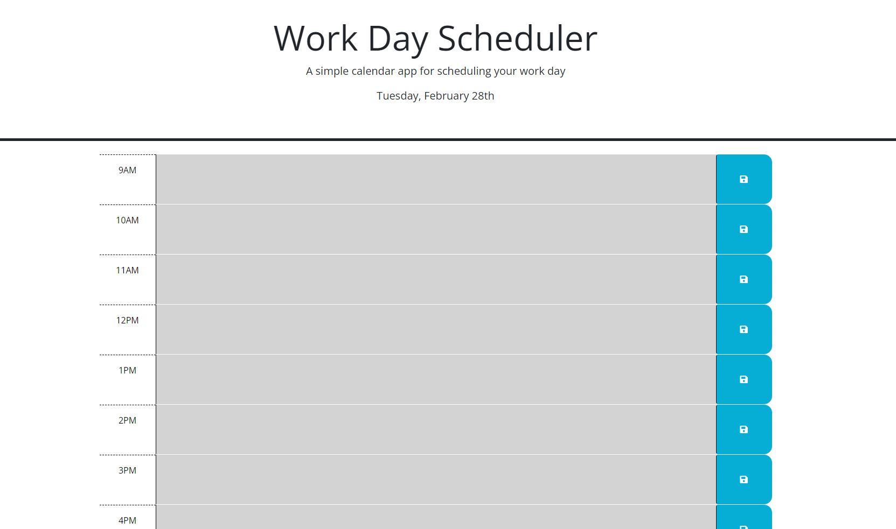

# Work Day Scheduler

https://jaystepz.github.io/Work-Day-Scheduler/
## Overview
This is an in-browser work day scheduler/planner for a 9AM to 5PM work schedule.
Each block covers an hour in which you can type and save whatever plans you have for the day.
Each block will also change color based on whether or not you are in that current hour (green for what's coming up, red is the current hour, and grey is for the past hours.)
## How to use
You can use this scheduler/planner by first clicking on the link to open it in your browser.
Once opened, start scheduling your day! Enter whatever it is you need to do within the middle box of each row for whenever you need to something!
After typing whatever you need to do for the day, be sure to click the save button to the right of whichever box(es) you've typed in so that it is saved should you accidentally or purposely close the tab and/or browser!
When you need to empty any or all of the boxes, you will have to delete the text manually. Be sure to save, otherwise those tasks will be waiting for you again!
The hour blocks will change color as the work day progresses for each hour. The color will update once you refresh the page or close and reopen the link. (Remember: Your last saved change will be displayed automatically!)
## Credits
A hearty thank you to my classmate, Nambdi, for helping me with the color-change function, and to another classmate, Bruno, for clarifying the CDN needed to be used from the Day.js website in order to get the Advanced Format plug-in to work!